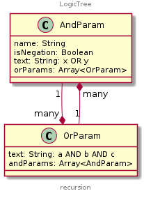

#  Abstract syntax tree for logic expressions

Build an AST (JSON object) from a logic expression string

## Input

```
    const logicExpression = 'a AND b OR c';
```

## Processing

```
    const bracketTree = new BracketTree(logicExpression);
    const logicTree = new LogicTree(bracketTree.nodes, bracketTree.text).getAst();
```

## Output

```
    console.log(logicTree);
    
    {
      name: 'node0',
      content: 'a AND b OR c',
      orParams: [{
        text: 'a AND b',
        andParams: [{ name: 'a' }, { name: 'b' }]
      }, {
        text: 'c',
        andParams: [{ name: 'c' }]
      }]
    }
```


## Logical operators

- [Logical negation NOT](https://en.wikipedia.org/wiki/Negation)
- [Logical conjunction AND](https://en.wikipedia.org/wiki/Logical_conjunction)
  - [Logical NAND](https://en.wikipedia.org/wiki/Sheffer_stroke)
- [Logical disjunction OR](https://en.wikipedia.org/wiki/Logical_disjunction)
  - [Logical NOR](https://en.wikipedia.org/wiki/Logical_NOR)
  - [Logical exclusive disjunction XOR](https://en.wikipedia.org/wiki/Exclusive_or)
  - [Logical equality XNOR](https://en.wikipedia.org/wiki/Logical_equality)

## Logical truth table

| a | b | AND | OR  | NAND| NOR | XOR | XNOR|
|---|---|:---:|:---:|:---:|:---:|:---:|:---:|
| 0 | 0 |  0  |  0  |  1  |  1  |  0  |  1  |
| 0 | 1 |  0  |  1  |  1  |  0  |  1  |  0  |
| 1 | 0 |  0  |  1  |  1  |  0  |  1  |  0  |
| 1 | 1 |  1  |  1  |  0  |  0  |  0  |  1  |

## Different syntax in programming and natural languages

| Language| Negation | Conjunction | Disjunction | XOR |
|---------|:--------:|:-----------:|:-----------:|:---:|
| C++     |  !       | &&          | \|\|        | ^   |
| Fortran | .NOT.    | .AND.       | .OR.        |.XOR.|
| Java    | !        | &&          |  \|\|       | ^   |
| Pascal  | not      | and         | or          | xor |
| PL/I    | ¬        | &           | \|          | ^   |
| Prolog  |  \+      | ,           | ;           |     |
| Turbo Basic | NOT  | AND         | OR          | XOR |
| SQL     | NOT      | AND         | OR          |     |
| English | not      | and         | or          | either |
| Russian | не       |  и          | или         | либо|

https://en.wikipedia.org/wiki/Logical_connective

## From boolean expression to logic tree

Input boolean expression: `(true OR false) AND NOT(false) OR true OR false`

### 1. Create a [binary boolean expression tree](https://en.wikipedia.org/wiki/Binary_expression_tree)


### 2. Skip logical negation operator (NOT, ~)

- A negation operator is unary. It applicable for one node only.
- Put it as a property of the corresponding node of the tree: `node.isNegation = true`

### 3. Transform all binary logical operators to basic: conjunction and disjunction

- a NAND b == NOT(A AND B)
- a XOR b  == (a OR b) AND (a NAND b)
- a XNOR b == NOT(a XOR b)


### 4. Order of precedence (priority) for basic syntax operators

|   Syntax  | Precedence |
|:---------:|:----------:|
|parenthesis|      1     |
|     NOT   |      2     |
|     AND   |      3     |
|     OR    |      4     |


### 5. Define own relations between basic logical binary operators

- AND can contain only ORs (1 to many)
- OR can contain only ANDs (1 to many)




### 6. Build an abstract syntax tree, using rules above

```
    // input
    (a OR b) AND NOT(c) OR d OR e

    // output
    {
      name: 'node0',
      content: '(a OR b) AND NOT(c) OR d OR e',
      orParams: [{
        text: '(a OR b) AND NOT(c)',
        andParams: [{
          name: 'node0',
          content: 'a OR b',
          orParams: [{
            text: 'a',
            andParams: [{ name: 'a' }]
          }, {
            text: 'b',
            andParams: [{ name: 'b' }]
          }]
        }, {
          name: 'c',
          isNegation: true
        }]
      }, {
        text: 'd',
        andParams: [{ name: 'd' }]
      }, {
        text: 'e',
        andParams: [{name: 'e' }]
      }]
    }
```

Where:

- `nodeX` - specific name for a parameter, which contains a group of other parameters, where `X` - order number of a node in a list of operators
- `isNegation` - adds Logical negation (NOT) to the corresponding parameter

### 7. Use this logic tree for any business purposes

- calculate a result of a logic expression: `a>3 AND a<5 == false // (if a = 8)`
- build a presentational string, using any syntax (SQL, JAVA, PASCAL, etc.): `a AND b OR NOT c --> a && b || !c`
- draw a tree diagram for any logic expression
- build a [decision tree](https://en.wikipedia.org/wiki/Decision_tree)
- etc.
